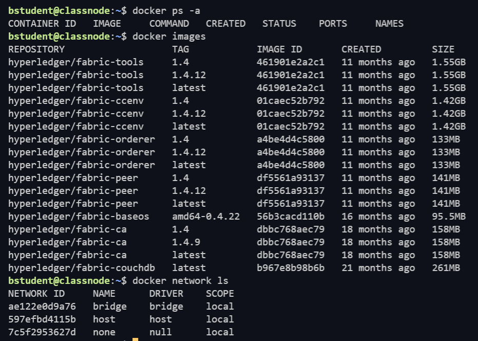
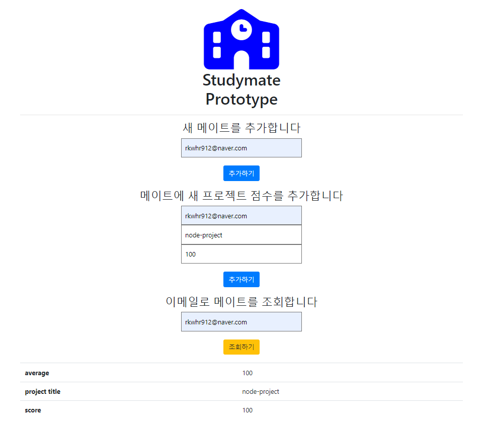

# studyMate

## Hyperledger Fabric 1.4 LTS 

## pre-condition

- `curl 7.68.0` , `docker 20.10.7` , `docker-compose 1.25.0` , `go 1.15.15` , `hyperledger fabric-docker images` , `hyperledger bineries cryptogen, configtxgen..` , `configured GOPATH`  

---

## stack

## Test Report

### First you need to check you stutus 1. docker container, 2. docker images and docker network
### for check your status,
1. `docker ps -a`
2. `docker images`
3. `docker network ls`

this is the clean status

### if u have some container, images or network please remove all
1. `docker rm -f $(docker ps -aq)` 
2. `docker rmi -f $(docker images dev-* -q)` 
3. `docker network prune` and y

---
### A. network 

- cd network 
    - `./generate.sh`

    -  `./start.sh`

---

### B. contract
- cd contract
    - `ls` -> `cc_study_v1.0.sh , studymate.go`
    
    - `./cc_study_v1.0.sh instantiate v1.0`

- check chaincode whether installed, instantiated or not
    - `docker exec cli peer chaincode list --installed`
    - `docker exec cli peer chaincode list --instantiated -C mychannel`

---

### C. prototype
- cd prototype
    - `npm install`

- certification works
    - `node enrollAdmin.js`
    - `node registerUser.js`
### server start
    - `node server.js`

---

### D. open ip OR localhost:8080 in the website

## Issue List

---

## Release Note

- add nodemon

---
